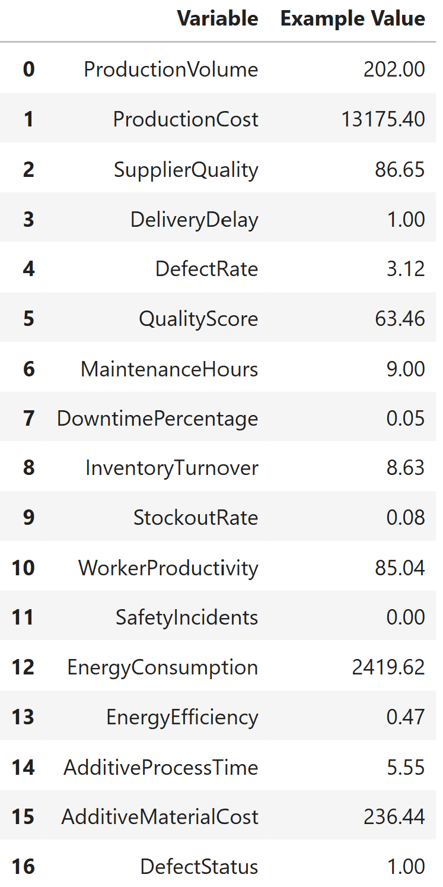
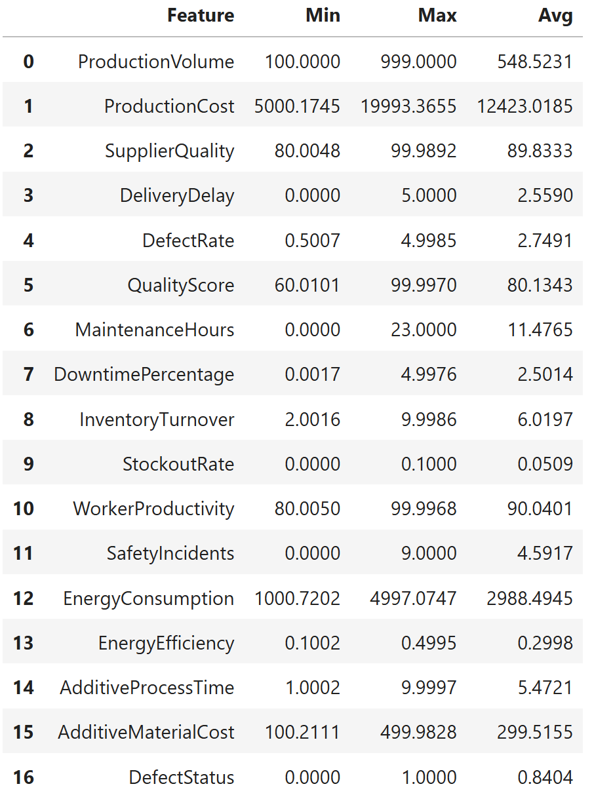

# 📊 Manufacturing Defect Analysis & Optimization

## 1️⃣ Introduction
In modern manufacturing systems, early detection of defective components is critical for maintaining quality and minimizing downstream costs. If a model can accurately identify defective parts, it can flag them for manual inspection and prevent failures downstream. However, choosing the right model isn’t just trial and error. It requires understanding the structure of the data and the behavior of different algorithms under the same conditions.
This project evaluates three standard classification models — Logistic Regression, Decision Tree, and Random Forest — to determine which performs best on a shared defect prediction task. I emphasize exploratory data analysis as a foundation for model selection by using visual and statistical tools to identify patterns, correlations, and potential sources of model error. The goal is not to build new models, but to assess which existing method is most effective for this classification problem and why. The Jupyter Notebook IDE is utilized with Python and SQL to extrapolate and analyze the data. You can find the full code above.

## 2️⃣ Problem Overview and Dataset
I use a simulated dataset consisting of observations from a manufacturing process. Each record represents various metrics crucial for predicting high or low defect occurrences in production processes.

<p align="center">
 
</p>


The minimum, maximum, and average values are then extracted from the data to help us better understand the range for each of the parameters.

<p align="center">
 
</p>

To further understand the structure of the dataset, I computed confidence intervals for the proportion of high-defect and low-defect parts. The binary target variable indicates whether a defect was present (1) or not (0). Below is the total count and percentage of each defect status type.

Out of 3,240 total parts, 2,723 were labeled as high-defect and 517 as low-defect, yielding an observed defect rate of 84.0%. The 95% confidence interval for the high-defect rate was [82.7%, 85.4%], while the interval for low-defect parts was [14.6%, 17.3%]. These results confirm a substantial class imbalance in the dataset. This imbalance has important implications for model evaluation. Metrics like accuracy would be misleading, as a model could achieve over 80% accuracy by predicting only the majority class. This further validates my decision to focus on F1 score, precision, and recall as evaluation metrics that better capture model effectiveness in imbalanced classification settings (which will be discussed later).

Since DefectStatus is either 0 or 1, plotting it directly against continuous features would result in meaningless or noisy visualizations. To solve this, I aggregated the data by computing the defect percentage within bins or categories of each variable. For categorical features like MaintenanceHours and SafetyIncidents, it groups the data by each unique value and calculates the proportion of defective batches, effectively summarizing how defect rates vary across discrete levels. For continuous variables, the code bins each feature into 5 equal-width intervals, then computes the defect rate within each bin. This binning allows continuous features to be discretized and analyzed in a format compatible with continuous scatterplots, where the x-axis represents feature ranges and the y-axis shows corresponding defect percentages. The resulting defect percentage values enable visual trend comparisons across features, even though the underlying model is binary classification. This allowed me to identify which variables may be predictive or correlated with quality issues in the manufacturing process. 

Notable relationships between defect status and other variables are shown below. MaintenanceHours, SupplierQuality, AdditiveMaterialCost, WorkerProductivity, ProductionVolume, and ProductionCost all had a positive correlation with defect status. On the other hand, SafteyIncidents and QualityScore had a negative correlation with defect status.

Kernel Density Estimation (KDE) plots were used to visualize how the distribution of key predictors differs between low/high-defect parts. For instance, MaintenanceHours and ProductionVolume showed clear separation between classes, with high-defect parts concentrated in higher ranges. In contrast, QualityScore showed the inverse relationship, where low-defect parts were more common at higher quality scores. The other variables showed little separation. These visualizations provide additional confirmation of the patterns later learned by our models, which reinforces the predictive utility of these features.

I used chi-squared tests to determine if there was statistical significance for each variable independently. 

The test revealed a strong association between MaintenanceHours, ProductionVolume and DefectStatus (p < 0.05), suggesting that scheduled maintenance and the volume of  total output play a significant role in preventing or mitigating defects. In contrast, the other variables showed no significant association (p > 0.05), indicating that they are likely independent of defect occurrence in this dataset. These results were also somewhat consistent with our KDE distribution plots, which showed clear separation between high-defect and low-defect groups for MaintenanceHours and ProductionVolume – the same variables with the lowest p-values. This convergence of statistical and visual evidence strengthens the case for their predictive relevance. However, due to the limited sample size, these tests have low statistical power, meaning some real effects could go undetected. Furthermore, chi-squared tests only evaluate individual associations and ignore interactions or nonlinear effects. To account for potential interdependencies between variables and to better capture their combined predictive power, I will apply powerful model approaches.

## 3️⃣ Evaluation Metric
To measure model performance, I prioritized F1 Score over simple accuracy. 

While accuracy measures the overall proportion of correct predictions, it can be misleading in imbalanced datasets like ours, where the majority of components are defective. F1 Score, the harmonic mean of precision and recall, offers a more balanced view. To support this choice, I also report precision and recall individually, providing additional insight into each model’s tradeoffs. In this case:

Precision: The proportion of predicted defective components that are actually defective. It answers: When the model predicts a defect, how often is it correct?

Recall: The proportion of actual defective components that were correctly identified. It answers: Of all real defects, how many did the model catch?

False Positives (Type 1 Error): This occurs when a good part is flagged as defective. There is wasted time and resources on unnecessary inspection.
False Negatives (Type 2 Error): This occurs when the model fails to catch a part with a real defect. There are faulty components allowed to reach production, which is potentially more costly.

## Model Comparison
This section evaluates three classification algorithms (Logistic Regression, Decision Tree, Random Forest) to determine which model most accurately predicts defective manufacturing components. The purpose is not to develop new predictive methods but to assess the comparative performance of standard classifiers on a shared dataset. Each model is trained on the same training data (80% of data) and tested on the same shared test split (20% of data) for a fair comparison.

Logistic Regression (LR)
What It Is: This is a linear model that estimates the probability of a binary outcome. In this case, it estimates the likelihood of DefectStatus = 1 (i.e., a high-defect component) as a function of multiple predictor variables. It assumes a linear relationship between the predictors and the log-odds of the outcome.

P(Y = 1) is the predicted probability that the component is defective.
X1​, X2… Xp are the feature values.
B0 is the intercept, and B1… Bp are the model coefficients.

We can solve for the predicted probability by applying the inverse of the logit function (the logistic function). This equation maps any linear combination of inputs into a probability between 0 and 1.

Model Fit: All numeric and categorical features (excluding the target) were standardized using z-score normalization to ensure comparability and improve convergence.The model produced coefficients for each feature, which were exponentiated to interpret them as odds ratios. These indicate how a unit increase in each feature changes the odds of a part being defective.

Features with odds ratios < 1 (associated with lower defect odds): QualityScore, EnergyEfficiency, WorkerProductivity, InventoryTurnover, SafetyIncidents, DowntimePercentage
Features with odds ratios > 1 (associated with increased defect odds): All other remaining variables

To assess classification behavior beyond coefficients, I examined the confusion matrix for the logistic regression model. Confusion matrices are tabular visualization tools that allow us to evaluate a model’s performance in terms of true positives, false positives, true negatives, and false negatives. These matrices helped me interpret how each model handles misclassification and whether certain models are systematically more conservative or lenient in labeling defects.

The model made 39 correct predictions of low-defect parts (true negatives) and 529 correct predictions of high-defect parts (true positives). However, it also misclassified 64 low-defect parts as defective (false positives) and 16 high-defect parts as low-defect (false negatives). While performance metrics like F1 score and accuracy are discussed later, this confusion matrix highlights the model's strong ability to identify defective parts, albeit with a tendency to over-classify low-defect components as defective. 

To evaluate the quality of probability estimates from the Logistic Regression model, I plotted a calibration curve. The curve generally aligns with the diagonal, indicating that the predicted probabilities are reasonably well-calibrated. However, there is slight underconfidence in the lower probability ranges, which suggests that when the model predicts a low chance of a defect, the actual frequency of defects is marginally higher than predicted. This is a common issue in imbalanced datasets. Overall, the model provides interpretable and relatively trustworthy probability outputs, making it useful in cost-sensitive applications where decision thresholds matter.

Logistic regression offers an interpretable baseline model that clearly reveals which features are most predictive of defects in terms of directional influence (via odds ratios). However, it does not account for nonlinear interactions or higher-order dependencies between features, which motivates the exploration of more flexible models like decision trees and random forests.

Decision Tree (DT)
What It Is: A non-parametric model that recursively splits the data into subgroups based on feature values, forming a tree-like structure. Each split maximizes information gain.
Model Fit: The Decision Tree model was trained using all available features in the dataset to classify parts as high or low defect. At first, no hyperparameters were applied, meaning the tree was allowed to grow fully until all leaves were pure or met the default split conditions. Upon inspecting the trained model, the tree had a maximum depth of 24 and 141 leaves. A diagram of the tree was also generated to visualize the hierarchical decision process.

Then, I restricted the decision tree to a maximum depth of 3 to reduce overfitting and improve interpretability. Interestingly, the F1 score remained unchanged compared to the fully grown tree, suggesting that the model's most informative splits occur within the top three levels. This indicates that a simpler tree can achieve comparable performance, capturing the dominant predictive patterns without relying on deeper, potentially overfit branches.

Feature importance analysis showed that QualityScore, DefectRate, ProductionVolume, and MaintenanceHours were the most influential predictors of defect status, suggesting these features are highly informative for rule-based classification.

The confusion matrix below summarizes the model’s classification performance on the test set:

This result indicates the tree is reasonably accurate, correctly identifying a majority of both low- and high-defect parts, though it still misclassifies a non-negligible number of low-defect cases.

Random Forest (RF)
What It Is: An ensemble model that builds many decision trees on bootstrapped samples and averages their predictions (majority voting for classification). It introduces randomness in feature selection to reduce overfitting and improve generalization.
Model Fit: The Random Forest classifier was trained using the same feature set, leveraging 100 randomized decision trees to improve predictive performance and reduce overfitting. Unlike a single decision tree, the ensemble aggregates multiple weak learners to produce a more stable and generalizable prediction. A grid search was performed to find the best parameters for the Random Forest model, yielding:

Total Fits:
bootstrap:
class_weight: 
max_depth: the maximum depth of each tree; limits how many splits a tree can make, controlling model complexity and overfitting. 
max_features: 
min_samples_leaf: the minimum number of samples required to be at a leaf node; prevents small, noisy splits by enforcing a minimum leaf size.
min_samples_split: the minimum number of samples required to split an internal node; higher values reduce tree branching and can improve generalization.
n_estimators: the number of decision trees in the forest; more trees generally improve performance but increase training time.
Feature importance analysis revealed that MaintenanceHours, DefectRate, QualityScore, and ProductionVolume were the most informative predictors, consistent with patterns seen in the standalone decision tree model.

The confusion matrix below summarizes the model’s classification performance on the test set:

This shows that the Random Forest achieved the strongest separation between defect classes among the three models, where it only misclassified 4 high-defect parts and 28 low-defect parts. This suggests it balances precision and recall well, even in the presence of class imbalance.


## Results
This section compares the predictive performance of three established classification models (Logistic Regression, Decision Tree, Random Forest) on a shared defect classification task. To clarify, the goal is not to create new models but to evaluate how well each performs given the same data inputs and output labels (DefectStatus = 0 or 1).The following table summarizes the performance of each model on the test set:

The Random Forest model outperforms both Logistic Regression and Decision Tree models in all three metrics. As expected, accuracy is also high for all three models.

To validate that Random Forest’s strong performance was not the result of a favorable data split, I performed 5-fold cross-validation. This approach ensures that every observation is used for both training and validation, and provides a more robust estimate of real-world performance. Cross-validation is a resampling technique used to assess how a model generalizes to unseen data. Specifically, the training data is partitioned into five equally sized folds. In each round, the model is trained on four folds and validated on the remaining one. This process is repeated five times so that each fold serves as the validation set once. The resulting F1 scores are then averaged to estimate the model’s expected performance on new data. This approach helps guard against overfitting by ensuring that our evaluation is not biased by any particular train-test split and provides a more reliable estimate of the model’s real-world predictive capability.

 The average weighted F1 score across folds was 0.950, but one fold showed notably lower performance (0.794), resulting in a wider 95% confidence interval of [0.840, 1.000]. This suggests that while the model performs well on average, performance may degrade under certain data partitions, possibly due to class imbalance or underrepresented feature combinations in some folds.

Logistic Regression has the highest number of false positives and slightly more false negatives than Random Forest. Decision Tree shows relatively balanced performance but still makes more mistakes than Random Forest. Random Forest achieves the best overall trade-off, minimizing both types of errors and suggesting stronger generalization across defect prediction.

To evaluate each model’s ability to discriminate between defective and non-defective components, I computed the ROC (Receiver Operating Characteristic) curves and corresponding AUC (Area Under Curve) values. ROC-AUC assesses how well the models separate the two classes across all classification thresholds.These values suggest that all three models are reasonably effective at distinguishing between classes, with Random Forest offering the best overall discrimination ability.

However, because our dataset is heavily imbalanced (most parts are defective), Precision-Recall (PR) curves provide a more informative measure. PR curves emphasize performance on the minority class (low-defect parts), where recall (sensitivity) and precision are most relevant.

While the average precision (AP) scores for all three models were similarly high (RF = 0.93, DT = 0.94, LR = 0.93), the shape of each model’s Precision-Recall (PR) curve reveals important behavioral differences across classification thresholds.

Logistic Regression:
The PR curve for LR starts off relatively low at low recall values, indicating that the model initially struggles with precision when only capturing the easiest (most obvious) positives. It then climbs rapidly, peaking at moderate recall values, before dropping again at higher thresholds. This suggests LR is sensitive to thresholding, where it performs well in a middle range but less reliably at the extremes.
Decision Tree:
DT starts with a high precision at low recall values and gradually decreases, maintaining strong performance through most thresholds. This steady decline implies DT consistently ranks true defect cases above non-defective ones but eventually encounters diminishing returns as it is forced to classify more borderline cases.
Random Forest:
The RF curve mirrors LR early on but maintains elevated precision for a longer portion of the curve before tapering off. This indicates that RF maintains a better balance of precision and recall over a wider threshold range, likely due to its ensemble nature smoothing out noisy decisions from individual trees.
These curve profiles highlight how the models handle ranking confidence differently. While AP summarizes performance, the shape of the curve is critical for decision-making in operational contexts. For example, if the goal is to catch the majority of defects without triggering excessive false alarms, RF or DT may be preferred over LR due to their stability across thresholds.

##  Discussion
Beyond raw performance metrics, our results also reflect broader statistical properties of the models and the data. Logistic Regression, being a linear model, had limited capacity to capture nonlinear relationships between features. This likely contributed to its lower F1 score and aligns with the concept of underfitting, where a model with high bias fails to represent the complexity of the data. However, Logistic Regression remains valuable for interpretability: each feature's coefficient provides a direct estimate of how a one-unit change affects the log-odds of a defect, allowing clear insights into predictors like QualityScore, EnergyEfficiency, or WorkerProductivity, all of which showed odds ratios less than 1 in our model.
The Decision Tree model captured nonlinear and interaction effects through a sequence of rule-based splits. Initially, the tree grew to a depth of 24 with 141 leaves, which reflects a highly specific partitioning of the feature space. To assess whether this complexity was necessary, we applied hyperparameter tuning and retrained the model with a maximum depth of 3. Surprisingly, this pruned version retained the same F1 score and classification metrics as the original despite being much simpler. This suggests that most of the predictive power was concentrated in the first few splits involving QualityScore, DefectRate, ProductionVolume, and MaintenanceHours. Deeper branches added little to no additional generalization. In practice, this makes the pruned tree a strong candidate because it maintains interpretability, avoids overfitting, and performs on par with the full-depth version.
Random Forest mitigates this by combining many decision trees trained on bootstrapped samples and random feature subsets. This averaging effect reduces variance while retaining the ability to model nonlinear effects. Our feature importance results showed that the same key variables were consistently influential across trees. This ensemble stability and the model's strong performance across all folds suggest excellent generalization. The broader pattern here is that Random Forest's ability to model complex, interacting feature effects without imposing strong distributional assumptions makes it especially suited to our dataset, which likely contains nonlinearity and threshold effects.
Permutation importance analysis showed strong agreement between Logistic Regression and Random Forest on which features drive model predictions. Both models identified MaintenanceHours, DefectRate, QualityScore, and ProductionVolume as the most important variables and consistently ranked them the highest. Importantly, both models assigned near-zero importance to all other features.

This mutual sparsity is significant. It suggests that despite differing model architectures and assumptions, both algorithms converge on the same core subset of features as meaningful predictors of defects. Logistic Regression arrives at this via linear coefficients (odds ratios), while Random Forest confirms it through aggregated decision paths.
The lack of importance for remaining variables across both models indicates that they do not carry substantial predictive signals in this dataset (at least not in a form detectable by either model). This convergence enhances confidence in the robustness of the selected top features and underscores that feature selection would likely improve both model simplicity and interpretability without sacrificing performance.

## Conclusion
This project was not about building new algorithms, and instead evaluating how well three existing models (Logistic Regression, Decision Tree, Random Forest) predict manufacturing defects on a shared dataset. All models were trained and tested under identical conditions, and performance was assessed using F1 score, precision, recall, and confusion matrices.
The results show that while Logistic Regression offers transparency, it struggles with nonlinear or interaction effects. Decision Trees add flexibility but can overfit without constraints. Random Forest consistently delivered the best performance, especially in terms of generalization and error balance. That said, the tradeoff is interpretability, as RF is harder to explain in operational settings.
I have deliberately framed this as a comparative assessment, not a model development exercise. The same features consistently emerged as most important across statistical tests and model outputs, which reinforced their relevance. While performance was strong on this simulated data, deploying any of these models in a real manufacturing environment would require further steps like validation under sensor noise and shifting data distributions.
Ultimately, our analysis suggests that if the goal is reliable, generalizable prediction, Random Forest is the best option, but interpretability/model simplicity and real-world constraints should guide final deployment decisions.

## ✅ How to Install and Run the Project
### Prerequisites
Ensure you have the following installed:
- Python 3
- Jupyter Notebook
- PostgreSQL

### Installation Steps
1. Clone the Repository:
   ```bash
   git clone https://github.com/ScottTorzewski/Manufacture-Defect-ML-Project.git
   ```
2. Navigate to the Project Directory:
   ```bash
   cd Manufacture-Defect-ML-Project
   ```
3. Install Dependencies:
   ```bash
   pip install -r requirements.txt
   ```
4. Launch Jupyter Notebook:
   ```bash
   jupyter notebook
   ```
5. Open the `.ipynb` file and run the cells sequentially.

## How to Use the Project
1. Run all notebook cells sequentially to preprocess data, analyze trends, and generate visualizations.
2. Review SQL query results for defect rate analysis.
3. Adjust SQL queries and machine learning hyperparameters to explore further optimizations.
4. Experiment with alternative ML models.

## References
🔗 Original Dataset: [Kaggle - Predicting Manufacturing Defects Dataset](https://www.kaggle.com/datasets/rabieelkharoua/predicting-manufacturing-defects-dataset/data)

## License
This project is licensed under the **GNU General Public License v3.0**. See the LICENSE file for details.
```

